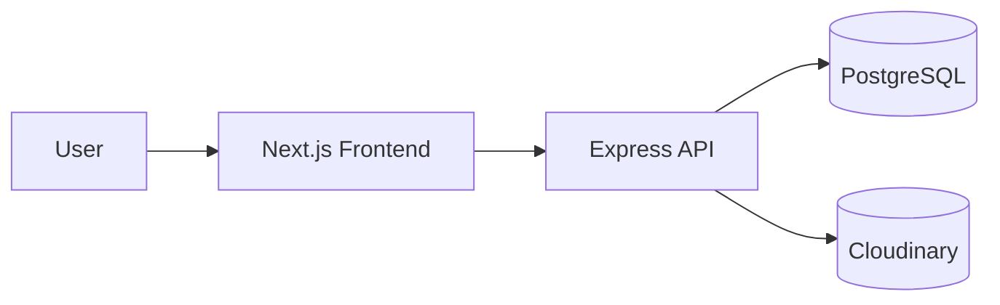
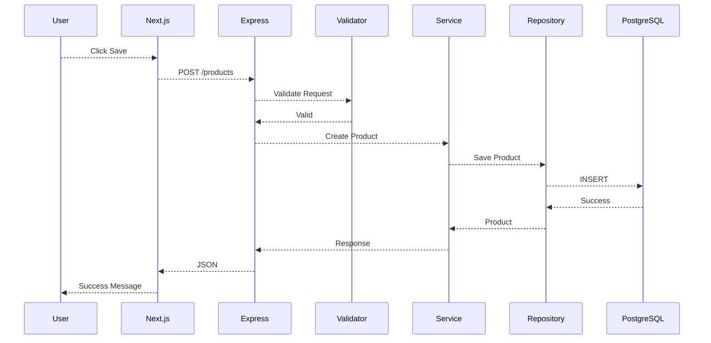

# System Architecture

Version: 1.0

Status: Draft

Author: Faiz

Last Updated: 2026-07-27

---

# Overview

This document describes the overall architecture of Opsora, including the frontend, backend, database, authentication, file storage, and deployment topology.

It serves as the technical blueprint for implementation.

## Technology Stack

| Layer             | Technology                |
|--------           |------------               |
| Frontend          | Next.js 15 (App Router)   |
| Backend           | Express.js                |
| Language          | TypeScript                |
| ORM               | Prisma ORM                |
| Database          | PostgreSQL                |
| Authentication    | JWT                       |
| Validation        | Zod                       |
| File Storage      | Cloudinary                |
| Styling           | Tailwind CSS              |
| State Management  | Zustand                   |
| Data Fetching     | TanStack Query            |
| API               | REST                      |
| Documentation     | Markdown                  |

## High-Level Architecture



## Backend Architecture

```text
src/
│
├── config/
├── controllers/
├── middlewares/
├── routes/
├── services/
├── repositories/
├── validators/
├── utils/
├── prisma/
└── app.ts
```
| Layer        | Responsibility               |
| ------------ | ---------------------------- |
| Routes       | Define API endpoints         |
| Controllers  | Handle HTTP request/response |
| Services     | Business logic               |
| Repositories | Database access via Prisma   |
| Validators   | Request validation           |
| Utils        | Shared helper functions      |

## Frontend Architecture

```text
src/
│
├── app/
├── components/
│   ├── ui/
│   ├── layout/
│   └── features/
├── hooks/
├── lib/
├── services/
├── stores/
├── types/
└── utils/
```
| Folder     | Purpose              |
| ---------- | -------------------- |
| app        | Routing (App Router) |
| components | Reusable UI          |
| services   | API Client           |
| stores     | Zustand stores       |
| hooks      | Custom hooks         |
| lib        | Shared libraries     |
| utils      | Helper functions     |

## Request Flow


## Authentication Flow
```mermaid
flowchart TD
Login
↓
Validate Credentials
↓
Generate JWT
↓
Return Access Token
↓
Store Token
↓
Authenticated Requests
↓
Authorization Middleware
```

## File Upload Flow
User
↓
Choose Image
↓
Frontend Upload
↓
Express
↓
Cloudinary
↓
Image URL
↓
Database

## Deployment Architecture
```mermaid
flowchart LR
User
↓
Frontend (Vercel)
↓
Backend (Railway / Render)
↓
PostgreSQL
↓
Cloudinary
```

## Cross-Cutting Concerns
| Concern               | Solution                              |
| --------------------- | ------------------------------------- |
| Authentication        | JWT Middleware                        |
| Authorization         | Role-Based Access                     |
| Validation            | Zod                                   |
| Error Handling        | Global Error Middleware               |
| Logging               | Winston / Pino *(opsional untuk MVP)* |
| Environment Variables | `.env`                                |
| File Upload           | Cloudinary                            |
| Database Access       | Prisma                                |

## Future Improvements

- Redis caching
- Queue processing (BullMQ)
- WebSocket notifications
- Multi-warehouse support
- Multi-company support
- Audit log module
- Background jobs
