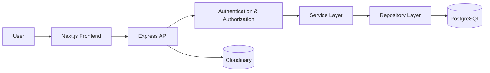
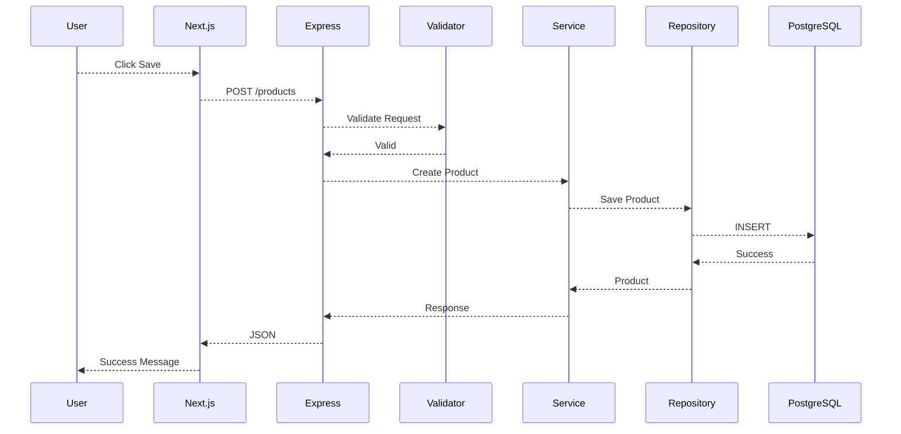
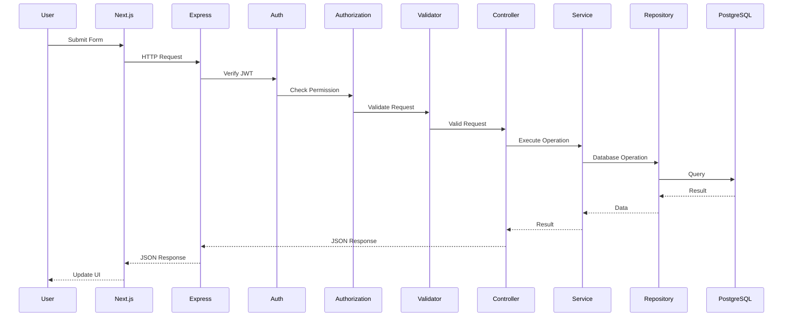

# System Architecture

Version: 1.1

Status: Completed

Author: Faiz

Last Updated: 2026-09-01

---

# Overview

This document describes the overall architecture of Opsora, including the
frontend, backend, database, authentication, authorization, file storage,
and deployment topology.

Opsora is organized into two major operational areas:

- Core Business Operations
- People Operations

The architecture is designed to support modular development, role-based
access control, transactional data integrity, and future scalability.

This document serves as the technical blueprint for implementation.

---

# Technology Stack

| Layer            | Technology              |
| ---------------- | ----------------------- |
| Frontend         | Next.js 16 (App Router) |
| Backend          | Express.js              |
| Language         | TypeScript              |
| ORM              | Prisma ORM              |
| Database         | PostgreSQL               |
| Authentication   | JWT                     |
| Authorization    | RBAC + Permissions      |
| Validation       | Zod                     |
| File Storage     | Cloudinary               |
| Styling          | Tailwind CSS             |
| State Management | Zustand                  |
| Data Fetching    | TanStack Query           |
| API              | REST                     |
| Documentation    | Markdown                 |

---

# High-Level Architecture



# System Modules

Opsora is divided into the following modules.

## Core Business Operations
- Dashboard
- Categories
- Products
- Suppliers
- Customers
- Purchases
- Sales
- Inventory
- Reports

## People Operations

- Employees
- Departments
- Attendance
- Leave
- Performance Reviews
- Payroll

## System Administration

- Users
- Roles
- Permissions
- Settings

# Architectural Principles

The system follows these principles:

1. Separation of concerns
2. Modular architecture
3. Clear responsibility between layers
4. Centralized authorization
5. Strong request validation
6. Transactional integrity for business operations
7. Consistent API contracts
8. Soft deletion for applicable master data
9. Secure handling of authentication credentials
10. Scalability without unnecessary complexity for the MVP

## Backend Architecture

```text
src/
│
├── config/
│
├── controllers/
│   ├── auth/
│   ├── users/
│   ├── categories/
│   ├── products/
│   ├── suppliers/
│   ├── customers/
│   ├── purchases/
│   ├── sales/
│   ├── inventory/
│   ├── reports/
│   ├── employees/
│   ├── departments/
│   ├── attendance/
│   ├── leave/
│   └── performance-reviews/
│
├── middlewares/
│   ├── auth.middleware.ts
│   ├── authorization.middleware.ts
│   ├── validation.middleware.ts
│   └── error.middleware.ts
│
├── routes/
│
├── services/
│
├── repositories/
│
├── validators/
│
├── utils/
│
├── prisma/
│
└── app.ts
```

## Backend Layer Responsibilities

| Layer        | Responsibility                                                |
| ------------ | ------------------------------------------------------------- |
| Routes       | Define API endpoints                                          |
| Controllers  | Handle HTTP requests and responses                            |
| Middlewares  | Authentication, authorization, validation, and error handling |
| Services     | Implement business logic                                      |
| Repositories | Handle database access through Prisma                         |
| Validators   | Validate request data                                         |
| Utils        | Shared helper functions                                       |
| Prisma       | Database schema and ORM configuration                         |

## Backend Request Flow

HTTP Request
     │
     ▼
Route
     │
     ▼
Authentication Middleware
     │
     ▼
Authorization Middleware
     │
     ▼
Validation Middleware
     │
     ▼
Controller
     │
     ▼
Service
     │
     ▼
Repository
     │
     ▼
PostgreSQL

## Responsibility Rules

Controllers should:

- Receive HTTP requests
- Extract parameters and body data
- Call the appropriate service
- Return HTTP responses
Controllers should not contain complex business logic.

Services should:

- Implement business rules
- Coordinate multiple repositories
- Validate business conditions
- Handle transactional operations

Repositories should:

- Communicate with PostgreSQL through Prisma
- Perform database queries
- Avoid containing business rules

## Frontend Architecture

```text
src/
│
├── app/
│   ├── login/
│   ├── dashboard/
│   ├── categories/
│   ├── products/
│   ├── suppliers/
│   ├── customers/
│   ├── purchases/
│   ├── sales/
│   ├── inventory/
│   ├── reports/
│   ├── employees/
│   ├── departments/
│   ├── attendance/
│   ├── leave/
│   ├── performance-reviews/
│   └── settings/
│
├── components/
│   ├── ui/
│   ├── layout/
│   └── features/
│
├── hooks/
├── lib/
├── services/
├── stores/
├── types/
└── utils/
```

## Frontend Folder Responsibilities

| Folder     | Purpose                            |
| ---------- | ---------------------------------- |
| app        | Application routes and pages       |
| components | Reusable UI components             |
| features   | Domain-specific frontend logic     |
| hooks      | Custom React hooks                 |
| services   | API communication                  |
| stores     | Zustand state management           |
| types      | Shared TypeScript types            |
| lib        | Shared libraries and configuration |
| utils      | Helper functions                   |

## Frontend Data Flow

User Interaction
       │
       ▼
Page / Component
       │
       ▼
TanStack Query
       │
       ▼
API Service
       │
       ▼
Express REST API
       │
       ▼
Response
       │
       ▼
UI Update

Zustand should be used for client-side application state that is not
better managed by server-state tools.

TanStack Query should be used for server state, caching, loading states,
and synchronization with the REST API.

## Request Flow


## Authentication Architecture

flowchart TD

Login[Login Page]
↓
Credentials[Email + Password]
↓
Validate[Validate Credentials]
↓
UserDB[(User Database)]
↓
JWT[Generate JWT]
↓
Token[Return Access Token]
↓
Client[Authenticated Client]
↓
Request[API Request]
↓
AuthMiddleware[Authentication Middleware]
↓
Authorization[Permission Check]
↓
Resource[Protected Resource]

## Authentication Responsibilities

### Authentication Middleware

Responsible for:

- Reading the Bearer token
- Verifying JWT signature
- Validating token claims
- Identifying the authenticated user
- Rejecting unauthenticated requests

### Authorization Middleware

Responsible for:

- Checking authenticated user's assigned role
- Checking required permissions
- Rejecting unauthorized actions

Authentication answers:
    Who is the user?
Authorization answers:
    What is the user allowed to do?

## Role and Permission Architecture

Opsora uses RBAC with permission-based authorization.

Default roles:

- SUPER_ADMIN
- OWNER
- ADMIN
- MANAGER
- STAFF
- CASHIER
Permissions should be defined by module and action.
Example:
products.read
products.create
products.update
products.delete

sales.read
sales.create
sales.update
sales.void

employees.read
employees.create
employees.update
employees.delete

attendance.read
attendance.create
attendance.update

leaves.read
leaves.create
leaves.approve
leaves.reject

performance_reviews.read
performance_reviews.create
performance_reviews.update
performance_reviews.delete

payroll.read
payroll.create
payroll.update
payroll.delete

This approach allows the system to add or modify roles without rewriting
authorization logic throughout the application.

## Database Architecture

Opsora uses PostgreSQL as the primary relational database.
Prisma ORM is used as the database access layer.

Application
     │
     ▼
Prisma ORM
     │
     ▼
PostgreSQL

The database contains entities covering:
### Core Business

- Users
- Roles
- Permissions
- Categories
- Products
- Suppliers
- Customers
- Purchases
- Purchase Items
- Sales
- Sale Items
- Inventory Movements

### People Operations

- Employees
- Departments
- Attendance
- Leave Requests
- Performance Reviews
- Payroll

## Database Integrity

Database operations must maintain referential integrity.

Examples:

- Purchase items must reference an existing product.
- Sale items must reference an existing product.
- Employees must reference valid departments.
- Attendance must reference an existing employee.
- Leave requests must reference an existing employee.
- Performance reviews must reference valid employees and reviewers.

Foreign key constraints should be used where appropriate.

## Transaction Integrity

Operations that modify multiple related records must use database
transactions.

### Purchase Completion

Complete Purchase
       │
       ▼
Validate Purchase
       │
       ▼
Update Product Stock
       │
       ▼
Create Inventory Movement
       │
       ▼
Mark Purchase Completed

All operations should succeed or fail as one atomic transaction.

### Sale Completion

Complete Sale
       │
       ▼
Validate Sale
       │
       ▼
Check Stock
       │
       ▼
Calculate Total
       │
       ▼
Update Product Stock
       │
       ▼
Create Inventory Movement
       │
       ▼
Record Payment
       │
       ▼
Complete Sale

If a required operation fails, the transaction should be rolled back.

## Inventory Architecture

Inventory quantity is maintained at the product level.
Every stock-changing operation must create an inventory movement.
Stock-changing operations include:

- Purchase
- Sale
- Stock Adjustment

Example:
Current Stock
     │
     ▼
Stock Operation
     │
     ▼
Calculate New Stock
     │
     ▼
Update Product
     │
     ▼
Create Inventory Movement

Inventory movement should record:
- Product
- Reference type
- Reference ID
- Before stock
- Quantity change
- After stock
- Notes


## File Upload Architecture

Product images are stored using Cloudinary.

User
 │
 ▼
Frontend
 │
 ▼
Express API
 │
 ▼
Validate File
 │
 ▼
Cloudinary
 │
 ▼
Image URL
 │
 ▼
PostgreSQL
The database stores the image URL rather than the binary image itself.

## File Upload Rules

The backend should validate:

File type
File size
Upload success
Returned Cloudinary URL

Only supported image formats should be accepted.

## API Architecture

Opsora exposes a REST API.

Base URL:
/api/v1
The API is divided into modules:
/api/v1/auth
/api/v1/users
/api/v1/roles
/api/v1/permissions
/api/v1/categories
/api/v1/products
/api/v1/suppliers
/api/v1/customers
/api/v1/purchases
/api/v1/sales
/api/v1/inventory
/api/v1/reports
/api/v1/employees
/api/v1/departments
/api/v1/attendances
/api/v1/leave-requests
/api/v1/performance-reviews
/api/v1/payrolls
/api/v1/dashboard
API details are defined in api-design.md.

## Request Processing


## Error Handling

Errors should be handled centrally through global error middleware.

The API should return consistent error responses.

Example:
```json
{
  "success": false,
  "error": {
    "code": "VALIDATION_ERROR",
    "message": "Validation failed."
  }
}
```
The backend should not expose:
- Database credentials
- Password hashes
- Internal stack traces
- Sensitive infrastructure information
in production responses.

## Validation

Zod is used for request validation.
Validation occurs before business logic execution.

HTTP Request
     │
     ▼
Zod Validation
     │
 ┌───┴────┐
 │        │
Valid   Invalid
 │        │
 ▼        ▼
Service  400/422
Business rules that require database state should be validated inside
the service layer.

## Security Architecture

Security controls include:

- JWT authentication
- Role and permission authorization
- Password hashing
- Request validation
- Input sanitization where required
- Secure environment variables
- File upload validation
- Rate limiting for sensitive endpoints
- Consistent error handling
- Database access through Prisma
- HTTPS in production

Sensitive configuration must not be committed to the repository.

## Environment Configuration

Environment-specific configuration should be stored using environment
variables.

Example:
```env
DATABASE_URL=
JWT_SECRET=
JWT_EXPIRES_IN=
CLOUDINARY_CLOUD_NAME=
CLOUDINARY_API_KEY=
CLOUDINARY_API_SECRET=
NEXT_PUBLIC_API_URL=
```
Environment files containing secrets must not be committed.
A safe example file such as .env.example should be maintained.

## Logging

The application should provide structured logging.
For the MVP, logging may use:

- Pino
- Winston

Logging should capture:

- Request information
- Error information
- Important business events
- Authentication failures
- Authorization failures
Sensitive information such as passwords and JWT secrets must never be
logged.

## Deployment Architecture
```mermaid
flowchart LR

User
↓
Frontend[Vercel - Next.js]
↓
Backend[Railway / Render - Express API]
↓
Database[(PostgreSQL)]

Backend --> Cloudinary[(Cloudinary)]
```

## Deployment Components

- Frontend
Next.js application deployed to a frontend hosting platform such as
Vercel.

- Backend
Express.js API deployed to a backend hosting platform such as Railway
or Render.

- Database
PostgreSQL hosted using a managed database service.

- File Storage
Cloudinary stores product images and other supported uploaded assets.

## Environment Separation

The system should support separate environments:
Development
     │
     ▼
Staging
     │
     ▼
Production

Each environment should have its own:
- Database
- Environment variables
- API configuration
- Storage configuration where appropriate

## Observability

The production system should provide enough information to identify:

- API errors
- Authentication failures
- Authorization failures
- Database failures
- File upload failures
- Slow requests

Future versions may introduce centralized monitoring and tracing.

## Scalability Strategy

The initial architecture is designed as a modular monolith.
Next.js
   │
   ▼
Express API
   │
   ├── Auth
   ├── Core Business
   ├── People Operations
   └── Reports
        │
        ▼
   PostgreSQL
This approach keeps MVP development simple while allowing modules to be
separated later if necessary.

## Future Scalability

Potential future improvements include:

- Redis caching
- Background job processing
- BullMQ
- WebSocket notifications
- Audit log module
- Multi-warehouse support
- Warehouse transfers
- Multi-company support
- Advanced reporting
- AI demand forecasting

These features are not required for the initial MVP architecture.

## Future Architecture Considerations

1. Multi-Warehouse

The inventory architecture may later introduce:
Warehouse
    │
    └── Warehouse Stock
            │
            └── Product
This should not be implemented until multi-warehouse requirements are
defined.

2. Multi-Company

Future company isolation may introduce:
Company
   │
   ├── Users
   ├── Products
   ├── Customers
   ├── Suppliers
   └── Transactions
This requires additional authorization and data-isolation rules.

## Architecture Decision

For the MVP, Opsora will use a modular monolith rather than microservices.

Reasons:

- Simpler deployment
- Lower operational complexity
- Easier local development
- Easier database transactions
- Suitable for the expected MVP scope
- Modules can be separated later if scaling requires it

## Cross-Cutting Concerns

| Concern               | Solution                |
| --------------------- | ----------------------- |
| Authentication        | JWT Middleware          |
| Authorization         | RBAC + Permissions      |
| Validation            | Zod                     |
| Error Handling        | Global Error Middleware |
| Logging               | Pino / Winston          |
| Environment Variables | `.env`                  |
| File Upload           | Cloudinary              |
| Database Access       | Prisma                  |
| Database              | PostgreSQL              |
| Client State          | Zustand                 |
| Server State          | TanStack Query          |
| API                   | REST                    |


## Related Documents
- requirements.md
- user-stories.md
- user-flow.md
- wireframes.md
- erd.md
- data-dictionary.md
- api-design.md
- glossary.md
- changelog.md

## Revision History
| Version | Date       | Description                                                                                                |
| ------- | ---------- | ---------------------------------------------------------------------------------------------------------- |
| 1.0     | 2026-07-27 | Initial architecture                                                                                       |
| 2.0     | 2026-08-11 | Updated architecture for RBAC, Core Business Operations, People Operations, and modular monolith structure |
