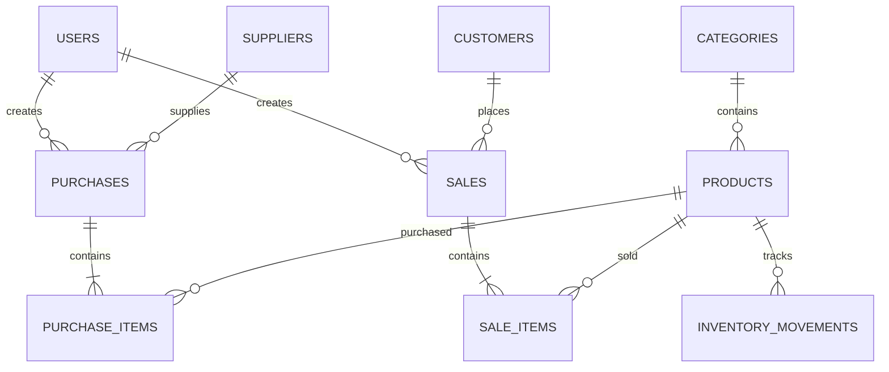

# Database Design (ERD)

Version: 1.0

Status: Draft

Author: Faiz

Last Updated: 2026-07-27

---

## Overview

This document defines the logical database design for Opsora.

It describes the entities, relationships, constraints, and business rules that support the application's core business processes.

This document serves as the primary reference for database implementation.

---

# Objectives

- Design a normalized database structure.
- Ensure data integrity.
- Support inventory management workflows.
- Support purchase and sales transactions.
- Provide a scalable foundation for future development.

---

## Database Standards

| Item              | Standard          |
|------             |----------         |
| Database          | PostgreSQL        |
| ORM               | Prisma ORM        |
| Primary Key       | UUID              |
| Naming Convention | snake_case        |
| Timestamp         | UTC               |
| Soft Delete       | Master data only  |
| Character Encoding| UTF-8             |

## Database Design Principles

### Transaction Snapshot Principle

Transaction records must preserve business data as it existed when the transaction occurred.

Master data may change over time, but completed transactions must remain immutable.

Examples

- Product selling price may change.
- Product purchase price may change.
- Supplier information may change.
- Customer information may change.

However,

- Purchase Item purchase_price must never change.
- Sale Item selling_price must never change.
- Historical reports must always reflect original transaction values.

## Entity List

| Entity              | Purpose                      |
| ------------------- | -----------------------------|
| users               | System users                 |
| categories          | Product categories           |
| products            | Products available for sale  |
| suppliers           | Supplier information         |
| customers           | Customer information         |
| purchases           | Purchase transaction headers |
| purchase_items      | Purchase transaction details |
| sales               | Sales transaction headers    |
| sale_items          | Sales transaction details    |
| inventory_movements | Inventory movement history   |

## Entity Specifications

| Field      | Type         | Required | Notes                                   |
| ---------- | ------------ | -------- | --------------------------------------- |
| id         | UUID         | ✅        | Primary Key                             |
| name       | VARCHAR(100) | ✅        | Full name                               |
| email      | VARCHAR(255) | ✅        | Unique                                  |
| password   | TEXT         | ✅        | Hashed                                  |
| role       | ENUM         | ✅        | SUPER_ADMIN / ADMIN / CASHIER / MANAGER |
| created_at | TIMESTAMP    | ✅        | Audit                                   |
| updated_at | TIMESTAMP    | ✅        | Audit                                   |
| deleted_at | TIMESTAMP    | ❌        | Soft delete                             |

### Entity: users

#### Purpose

Stores user accounts that can access the Opsora system.

---
#### Fields

| Field         | Type          | Required  | Description           |
|---------      |------         |---------- |-------------          |
| id            | UUID          | Yes       | Primary key           |
| name          | VARCHAR(100)  | Yes       | User full name        |
| email         | VARCHAR(255)  | Yes       | Login email           |
| password      | TEXT          | Yes       | Hashed password       |
| role          | ENUM          | Yes       | User role             |
| created_at    | TIMESTAMP     | Yes       | Record creation time  |
| updated_at    | TIMESTAMP     | Yes       | Record update time    |
| deleted_at    | TIMESTAMP     | No        | Soft delete timestamp |

---

#### Constraints

Primary Key

- id

Unique

- email

---

#### Indexes

- email
- role

---

#### Relationships

- One user can create many purchases.
- One user can create many sales.

---

#### Business Rules

- Email must be unique.
- Password must be stored in hashed format.
- Soft-deleted users cannot access the system.

---

### Entity: categories

Stores product categories used to organize products.

---
#### Fields

| Field         | Type          | Required  | Description           |
|---------------|---------------|-----------|-----------------------|
| id            | UUID          | Yes       | Primary key           |
| name          | VARCHAR(100)  | Yes       | Category name         |
| description   | TEXT          | No        | Category description  |
| created_at    | TIMESTAMP     | Yes       | Record creation time  |
| updated_at    | TIMESTAMP     | Yes       | Record update time    |
| deleted_at    | TIMESTAMP     | No        | Soft delete timestamp |

---

#### Constraints

Primary Key

- id

Unique

- name

---

#### Indexes

- name

---

#### Relationships

- One category can have many products.

---

#### Business Rules

- Category name must be unique.
- Soft-deleted categories cannot be assigned to new products.
- Categories that are referenced by active products cannot be permanently deleted.
---

### Entity: products
#### Purpose
Stores all products available for purchase and sale.

---
#### Fields
| Field         | Type          | Required | Description            |
|---------------|---------------|----------|------------------------|
| id            | UUID          | Yes      | Primary key            |
| category_id   | UUID          | Yes      | Product category       |
| sku           | VARCHAR(50)   | Yes      | Stock Keeping Unit     |
| barcode       | VARCHAR(100)  | No       | Product barcode        |
| name          | VARCHAR(150)  | Yes      | Product name           |
| description   | TEXT          | No       | Product description    |
| purchase_price| DECIMAL(15,2) | Yes      | Purchase price         |
| selling_price | DECIMAL(15,2) | Yes      | Selling price          |
| stock         | INTEGER       | Yes      | Current stock          |
| minimum_stock | INTEGER       | Yes      | Minimum stock alert    |
| unit          | VARCHAR(20)   | Yes      | Product unit           |
| image_url     | TEXT          | No       | Product image URL      |
| created_at    | TIMESTAMP     | Yes      | Record creation time   |
| updated_at    | TIMESTAMP     | Yes      | Record update time     |
| deleted_at    | TIMESTAMP     | No       | Soft delete timestamp  |

---

#### Constraints

Primary Key

- id

Foreign Key

- category_id → categories.id

Unique

- sku
- barcode

---

#### Indexes

- sku
- barcode
- name
- category_id

---

#### Relationships

- One category has many products.
- One product can appear in many purchase items.
- One product can appear in many sale items.
- One product has many inventory movements.

---

#### Business Rules

- Product name is required.
- SKU must be unique.
- Barcode must be unique when provided.
- Selling price must be greater than or equal to purchase price.
- Stock cannot be negative.
- Soft-deleted products cannot be used in new transactions.

### Entity: suppliers
#### Purpose
Stores supplier information used in purchase transactions.

---
#### Fields
| Field         | Type          | Required  | Description           |
|---------------|---------------|-----------|-----------------------|
| id            | UUID          | Yes       | Primary key           |
| name          | VARCHAR(150)  | Yes       | Supplier name         |
| contact_person| VARCHAR(100)  | No        | Primary contact       |
| email         | VARCHAR(255)  | No        | Supplier email        |
| phone         | VARCHAR(30)   | No        | Phone number          |
| address       | TEXT          | No        | Supplier address      |
| created_at    | TIMESTAMP     | Yes       | Record creation time  |
| updated_at    | TIMESTAMP     | Yes       | Record update time    |
| deleted_at    | TIMESTAMP     | No        | Soft delete timestamp |

---

#### Constraints

Primary Key

- id

---

#### Indexes

- name

---

#### Relationships

- One supplier can have many purchases.

---

#### Business Rules

- Supplier name is required.
- Soft-deleted suppliers cannot be selected for new purchases.

### Entity: customers
#### Purpose
Stores customer information used in sales transactions.

---
#### Fields
| Field     | Type          | Required  | Description           |
|---------  |------         |---------- |-------------          |
| id        | UUID          | Yes       | Primary key           |
| name      | VARCHAR(150)  | Yes       | Customer name         |
| email     | VARCHAR(255)  | No        | Customer email        |
| phone     | VARCHAR(30)   | No        | Phone number          |
| address   | TEXT          | No        | Customer address      |
| created_at| TIMESTAMP     | Yes       | Record creation time  |
| updated_at| TIMESTAMP     | Yes       | Record update time    |
| deleted_at| TIMESTAMP     | No        | Soft delete timestamp |

---

#### Constraints

Primary Key

- id

---

#### Indexes

- name
- phone

---

#### Relationships

- One customer can have many sales.

---

#### Business Rules

- Customer name is required.
- Walk-in Customer is created during database seeding.
- Soft-deleted customers cannot be selected for new sales.

### Entity: purchases
#### Purpose
Stores purchase transaction headers.

---
#### Fields
| Field             | Type          | Required | Description                    |
|---------          |------         |----------|-------------                   |
| id                | UUID          | Yes      | Primary key                    |
| purchase_number   | VARCHAR(50)   | Yes      | Purchase document number       |
| supplier_id       | UUID          | Yes      | Supplier reference             |
| user_id           | UUID          | Yes      | User who created the purchase  |
| transaction_date  | DATE          | Yes      | Purchase date                  |
| status            | ENUM          | Yes      | Purchase status                |
| total_amount      | DECIMAL(15,2) | Yes      | Total purchase amount          |
| notes             | TEXT          | No       | Additional notes               |
| created_at        | TIMESTAMP     | Yes      | Record creation time           |
| updated_at        | TIMESTAMP     | Yes      | Record update time             |

---

#### Constraints

Primary Key

- id

Foreign Keys

- supplier_id → suppliers.id
- user_id → users.id

Unique

- purchase_number

---

#### Indexes

- purchase_number
- supplier_id
- purchase_date
- status

---

#### Relationships

- One purchase belongs to one supplier.
- One purchase belongs to one user.
- One purchase has many purchase items.

---

#### Business Rules

- Purchase number must be unique.
- Purchase must contain at least one item.
- Total amount equals the sum of all purchase item subtotals.
- Only completed purchases update inventory.
- Cancelled purchases do not affect inventory.

### Entity: purchase_items
#### Purpose
Stores the detail lines of a purchase transaction.

---
#### Fields
| Field         | Type          | Required | Description                |
|---------      |------         |----------|-------------               |
| id            | UUID          | Yes      | Primary key                |
| purchase_id   | UUID          | Yes      | Purchase reference         |
| product_id    | UUID          | Yes      | Purchased product          |
| quantity      | INTEGER       | Yes      | Quantity purchased         |
| purchase_price| DECIMAL(15,2) | Yes      | Snapshot purchase price    |
| subtotal      | DECIMAL(15,2) | Yes      | Quantity × Purchase Price  |

---

#### Constraints

Primary Key

- id

Foreign Keys

- purchase_id → purchases.id
- product_id → products.id

---

#### Indexes

- purchase_id
- product_id

---

#### Relationships

- Many purchase items belong to one purchase.
- Many purchase items reference one product.

---

#### Business Rules

- Quantity must be greater than zero.
- Purchase price must be greater than zero.
- Subtotal is calculated automatically.
- Purchase price is stored as a transaction snapshot.

### Entity: sales
#### Purpose
Stores sales transaction headers.

---
#### Fields
| Field         | Type          | Required | Description                        |
|---------      |------         |----------|-------------                       |
| id            | UUID          | Yes      | Primary key                        |
| invoice_number| VARCHAR(50)   | Yes      | Sales invoice number               |
| customer_id   | UUID          | Yes      | Customer reference                 |
| user_id       | UUID          | Yes      | Cashier/Admin who created the sale |
| transaction_date     | DATE          | Yes      | Transaction date                   |
| status        | ENUM          | Yes      | Sales status                       |
| total_amount  | DECIMAL(15,2) | Yes      | Total sales amount                 |
| notes         | TEXT          | No       | Additional notes                   |
| created_at    | TIMESTAMP     | Yes      | Record creation time               |
| updated_at    | TIMESTAMP     | Yes      | Record update time                 |

---

#### Constraints

Primary Key

- id

Foreign Keys

- customer_id → customers.id
- user_id → users.id

Unique

- invoice_number

---

#### Indexes

- invoice_number
- customer_id
- sale_date
- status

---

#### Relationships

- One customer can have many sales.
- One user can create many sales.
- One sale has many sale items.

---

#### Business Rules

- Invoice number must be unique.
- Sale must contain at least one item.
- Total amount equals the sum of all sale item subtotals.
- Completed sales reduce product stock.
- Void sales do not affect inventory.

### Entity: sale_items
#### Purpose
Stores the detail lines of a sales transaction.

---
#### Fields
| Field         | Type          | Required | Description                        |
|---------      |------         |----------|-------------                       |
| id            | UUID          | Yes      | Primary key                        |
| sale_id       | UUID          | Yes      | Sales reference                    |
| product_id    | UUID          | Yes      | Sold product                       |
| quantity      | INTEGER       | Yes      | Quantity sold                      |
| selling_price | DECIMAL(15,2) | Yes      | Snapshot selling price             |
| subtotal      | DECIMAL(15,2) | Yes      | Quantity × Selling Price           |

---

#### Constraints

Primary Key

- id

Foreign Keys

- sale_id → sales.id
- product_id → products.id

---

#### Indexes

- sale_id
- product_id

---

#### Relationships

- Many sale items belong to one sale.
- Many sale items reference one product.

---

#### Business Rules

- Quantity must be greater than zero.
- Selling price must be greater than zero.
- Subtotal is calculated automatically.
- Selling price is stored as a transaction snapshot.

### Entity: inventory_movements
#### Purpose
Stores every inventory movement for auditing and stock tracking.

---
#### Fields
| Field         | Type      | Required  | Description               |
|---------      |------     |---------- |-------------              |
| id            | UUID      | Yes       | Primary key               |
| product_id    | UUID      | Yes       | Product reference         |
| reference_type| ENUM      | Yes       | PURCHASE, SALE, ADJUSTMENT|
| reference_id  | UUID      | Yes       | Related transaction ID    |
| quantity      | INTEGER   | Yes       | Quantity moved            |
| before_stock  | INTEGER   | Yes       | IN or OUT                 |
| after_stock   | INTEGER   | Yes       | IN or OUT                 |
| notes         | TEXT      | No        | Additional notes          |
| created_at    | TIMESTAMP | Yes       | Movement timestamp        |

---

#### Constraints

Primary Key

- id

Foreign Key

- product_id → products.id

---

#### Indexes

- product_id
- reference_type
- created_at

---

#### Relationships

- One product has many inventory movements.

---

#### Business Rules

- Every completed purchase creates an IN movement.
- Every completed sale creates an OUT movement.
- Every stock adjustment creates a movement.
- Inventory movements cannot be edited.
- Inventory movements cannot be deleted.

## Enums

### UserRole

- SUPER_ADMIN
- ADMIN
- MANAGER
- CASHIER

### PurchaseStatus

- DRAFT
- COMPLETED
- CANCELLED

### SaleStatus

- PENDING
- PAID
- VOID

### InventoryReferenceType

- PURCHASE
- SALE
- ADJUSTMENT

## Entity Relationship Diagram

## Assumptions & Limitations

Current database design assumes:

- Single company
- Single warehouse
- Single currency
- Single language
- No tax module
- No product variants
- No warehouse transfer
- No return transaction

These features may be added in future versions without changing the core transaction structure.