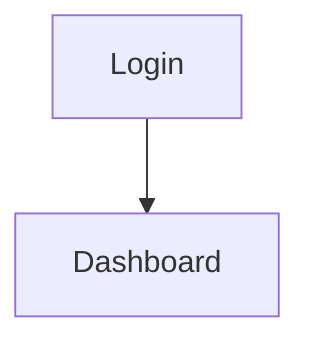

# Documentation Standard

Version: 1.0

Status: Active

Project: Opsora

---

# Purpose

This document defines the documentation standard used across the Opsora repository.

Every document should follow the same structure to improve readability, maintainability, and collaboration.

---

# Document Template

Every document must contain the following sections.

```
Title

Metadata

Overview

Content

Related Documents

Revision History
```

---

# Metadata

Each document starts with:

```md
Version: 1.0

Status: Draft

Author: Faiz

Last Updated: YYYY-MM-DD
```

---

# Related Documents

Example

```md
## Related Documents

- requirements.md
- user-stories.md
- user-flow.md
```

---

# Revision History

Every document ends with

```md
## Revision History

| Version | Date | Description |
|----------|------|-------------|
| 1.0 | YYYY-MM-DD | Initial document |
```

---

# Markdown Rules

- Use ATX headings (#, ##, ###)
- Use tables for structured information
- Use code blocks for diagrams
- Use Mermaid when appropriate
- Use relative links between documents
- Use sentence case for headings

---

# Naming Convention

Use lowercase and kebab-case.

Examples

```
user-stories.md
user-flow.md
api-design.md
coding-standards.md
```

---

# Diagram Standard

Use Mermaid whenever possible.

Example



---

# Status Values

Allowed values

- Draft
- Review
- Approved
- Deprecated

---

# Versioning

Major changes

```
1.0
2.0
3.0
```

Minor changes

```
1.1
1.2
1.3
```

Patch

```
1.0.1
1.0.2
```